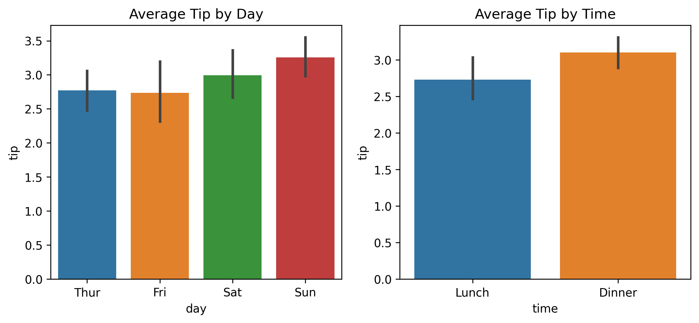
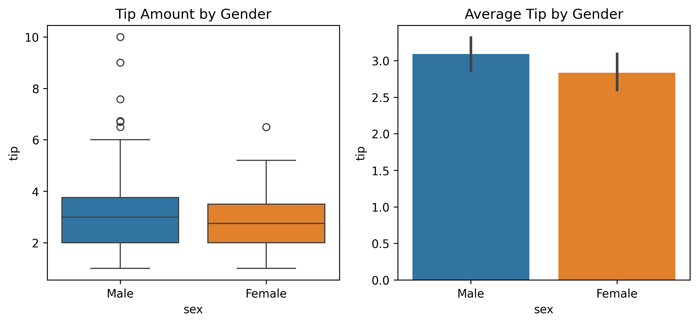
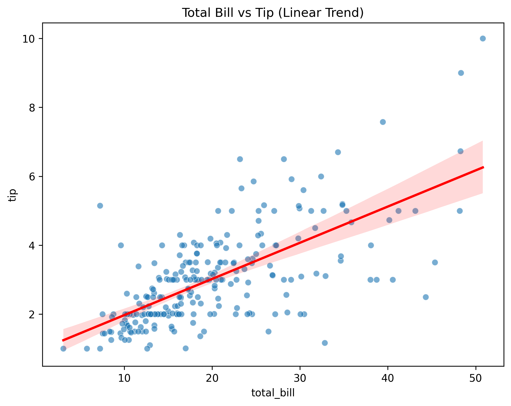
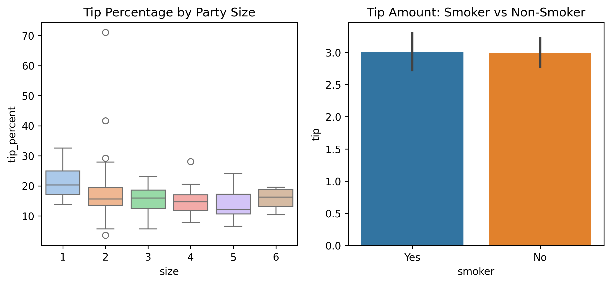
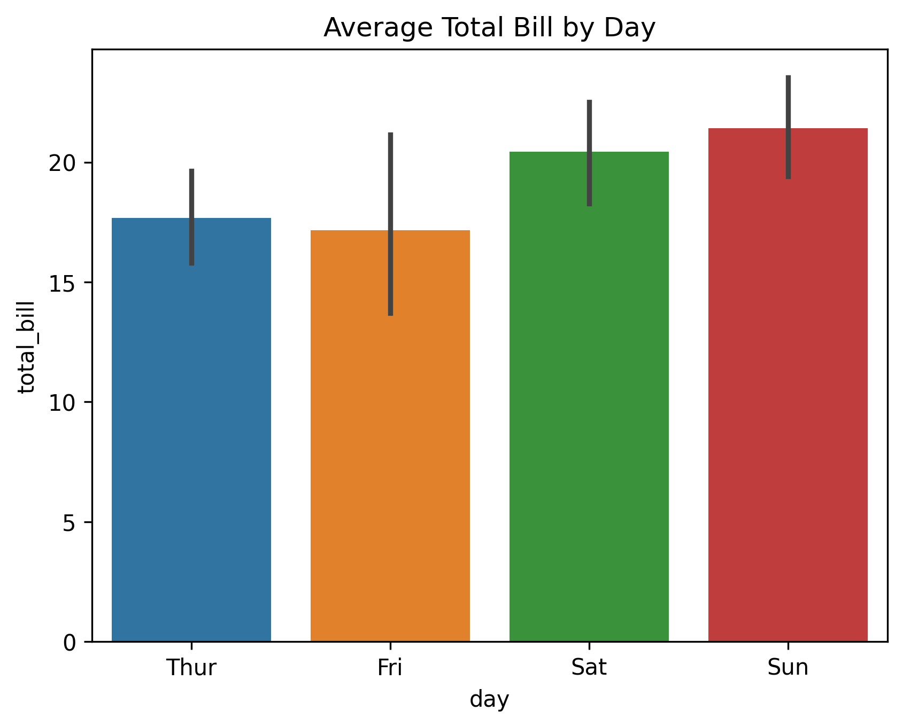
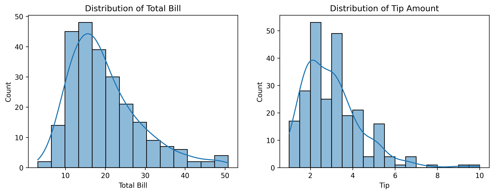
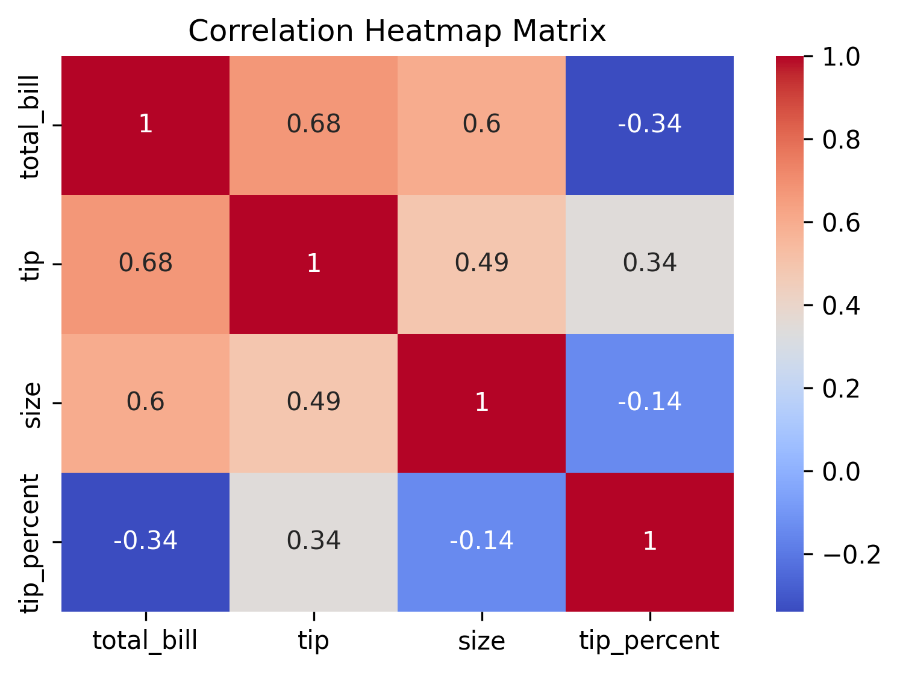

# 💰 Tips Dataset — Exploratory Data Analysis

## 📑 Table of Contents
1. [Objective](#objective)
2. [Project Description](#project-description)
3. [Dashboard](#dashboard)
4. [Insights](#insights)
5. [Requirements](#requirements)
6. [Authors and Contact](#authors-and-contact)

---

## 🎯 Objective
To explore tipping behavior in restaurants and analyze patterns in relation to gender, day, time, total bill, and smoking status using Seaborn visualizations.

---

## 📘 Project Description
The **Tips dataset** contains information about restaurant bills and the corresponding tips given by customers.  
The goal is to identify relationships between variables such as:
- Gender and tipping habits  
- Day and time effects on tips  
- Relationship between total bill and tip amount  
- Party size influence on tipping percentage  
- Smoking vs. non-smoking customers

---

## 📊 Dashboard

| Plot | Description |
|------|--------------|
|  | Average tip by day and time |
|  | Tip distribution by gender |
|  | Total bill vs. tip trend |
|  | Party Size and Smoking effect on tipping |
|  | Average Total Bill by Day |
|  | Distribution of Bill and Tip |
|  | Heatmap Matrix |

---

## 💡 Insights
- **Average tip percentage:** Around 16% of total bill.  
- **Gender:** Male customers tend to give slightly higher absolute tips, but females often tip higher relative to the bill.  
- **Day and time:** Highest total bills on **Saturday/Sunday evenings**.  
- **Smoking:** No strong impact on tipping observed.  
- **Relationship:** Total bill and tip show a **positive linear trend**.  
- **Party size:** Larger groups leave slightly higher tips but not proportionally larger.

---
```
eda-tips-python/
├── README.md              # summary, questions, key insights, images
├── notebooks/
│   └── EDA-tips.ipynb     # Jupyter notebook
├── images/
│   ├── tips_avg_total_bill_by_day.png
│   ├── tips_heatmap_matrix.png
│   ├── tips_perc_by_size_and_smoker.png
│   ├── tips_tip_by_gender.png
│   ├── tips_tip_per_day.png
│   ├── tips_totalbill_distribution.png
│   └── tips_total_bill_vs_tip.png
└── requirements.txt       # seaborn, pandas, matplotlib, jupyter
```
---

## 🚀 How to Use
1. Clone this repository.  
2. Navigate to the `notebook/` folder.  
3. Open the `.ipynb` files using **Jupyter Notebook**.  
4. Explore the jupyter file for deeper analysis.  

---

## 👨‍💻 Author & Contact
**Author:** Mohd Walid Ansari  
**Email:** [walidmohd2532001@gmail.com](mailto:walidmohd2532001@gmail.com)  
**GitHub:** [mohdwalid253](https://github.com/mohdwalid253)   
**LinkedIn:** [Mohd Walid Ansari](https://www.linkedin.com/in/mohdwalidansari/)